# BoxPassword 사용자 가이드

처음 쓰시는 분을 위한 단계별 안내. 각 절은 5분 안에 따라 할 수 있도록 정리했습니다.

스크린샷은 `docs/screenshots/` 폴더의 SVG 자리표시로 채워져 있어요. 본인이 캡처한 PNG 로 교체하면 됩니다(같은 파일명 유지 권장).

---

## 목차

1. [첫 실행 / 마스터 비밀번호 설정](#1-첫-실행--마스터-비밀번호-설정)
2. [잠금 / 잠금 해제](#2-잠금--잠금-해제)
3. [메인 화면 둘러보기](#3-메인-화면-둘러보기)
4. [첫 항목 추가하기](#4-첫-항목-추가하기)
5. [패스워드 생성기 사용하기](#5-패스워드-생성기-사용하기)
6. [항목 사용하기 — 복사 · 보기 · TOTP](#6-항목-사용하기--복사--보기--totp)
7. [비밀번호 변경 + 변경 이력](#7-비밀번호-변경--변경-이력)
8. [그룹으로 정리하기](#8-그룹으로-정리하기)
9. [건강 검진으로 약점 찾기](#9-건강-검진으로-약점-찾기)
10. [백업과 복구](#10-백업과-복구)
11. [다른 매니저에서 CSV 가져오기](#11-다른-매니저에서-csv-가져오기)
12. [메뉴바 트레이로 빠르게 쓰기](#12-메뉴바-트레이로-빠르게-쓰기)
13. [Quick Search 글로벌 단축키 (⌘⇧K)](#13-quick-search-글로벌-단축키-k)
14. [설정 옵션 정리](#14-설정-옵션-정리)
15. [마스터 비밀번호 변경하기](#15-마스터-비밀번호-변경하기)
16. [자주 묻는 질문 (FAQ)](#자주-묻는-질문-faq)

---

## 1. 첫 실행 / 마스터 비밀번호 설정

처음 BoxPassword 를 열면 setup 화면이 뜹니다. 이 한 번의 비밀번호로 모든 데이터가 봉인되니까 **충분히 길고 본인만 기억할 수 있는 문장형 비밀번호** 를 권장합니다.

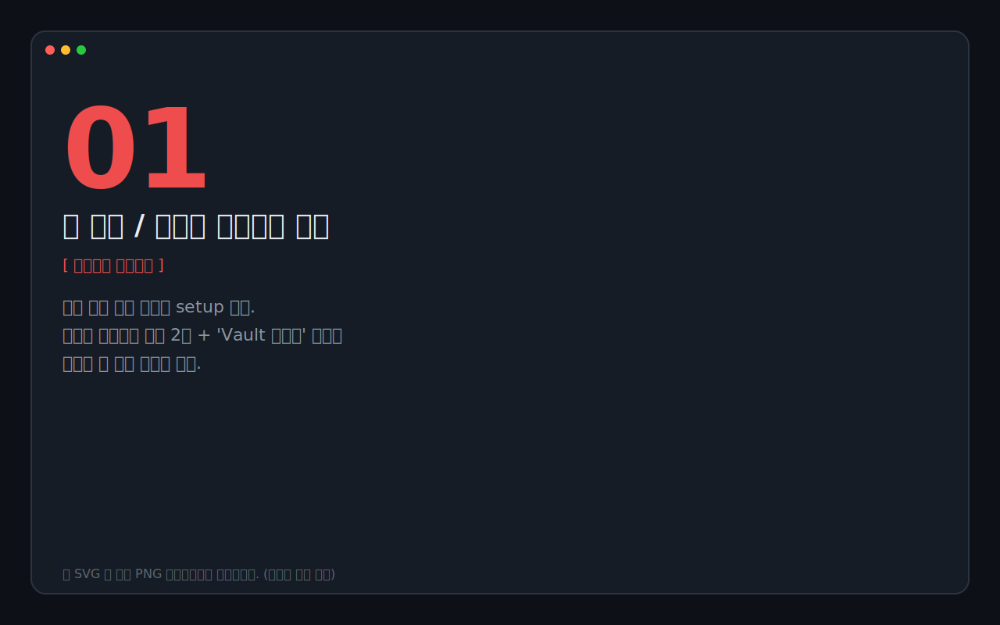

**입력 규칙**
- 최소 8자 (실제로는 14자 이상 권장)
- 두 칸에 같게 입력 — 오타 방지
- 분실하면 **복구 경로 없음**. 별도 종이에 적어 안전한 곳에 보관하거나, 다른 비밀번호 매니저에 적어두세요.

"Vault 만들기" 클릭 → 즉시 잠금 해제 상태로 메인 화면 진입.

> 💡 **마스터 비밀번호 추천 형식**: `correct-horse-battery-staple-2026` 처럼 의미 있는 단어 4-5개를 하이픈으로 연결. 길고 외우기 쉬움.

---

## 2. 잠금 / 잠금 해제

잠금 트리거
- **⌘L** 단축키
- 트레이 메뉴 → "Vault 잠그기"
- 설정에서 정한 비활동 시간(기본 5분) 경과
- 시스템 슬립 (옵션, 기본 ON)
- 다른 앱으로 포커스 이동 (옵션, 기본 OFF)

잠금 화면에서는 마스터 비밀번호로 다시 해제할 수 있습니다.


**자동 잠금 해제 (선택)**

매번 마스터 비밀번호 입력이 번거롭다면 설정에서 **"OS 자격 증명 저장소 자동 잠금 해제"** 를 켜두세요. macOS Keychain / Windows Credential Manager 에 vault key 를 보관해 다음 실행부터 자동으로 해제됩니다. 자세한 보안 모델은 [14절](#14-설정-옵션-정리) 참고.

---

## 3. 메인 화면 둘러보기

잠금 해제 후 보이는 화면은 3분할 구조입니다.

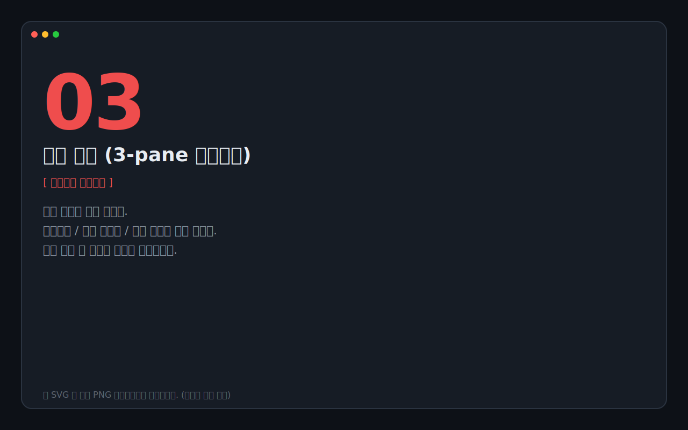

| 영역 | 내용 |
|---|---|
| **왼쪽 사이드바** | Library(전체·즐겨찾기·최근) / 그룹 / Vault 액션(백업·복구·CSV·건강 검진·설정) / 하단에 잠금 상태 + 항목 수 |
| **가운데 리스트** | 검색 박스(⌘F) + 정렬 드롭다운 + 새 항목 버튼(+, ⌘N) + 항목 카드들 |
| **오른쪽 상세** | 선택된 항목의 사용자명 · 패스워드 · URL · 메모 · TOTP · 변경 이력 |

상단 우측의 ☼/☾ 아이콘으로 테마 전환 (auto → light → dark).

---

## 4. 첫 항목 추가하기

가운데 리스트 상단의 **+** 또는 **⌘N** 으로 모달을 엽니다.

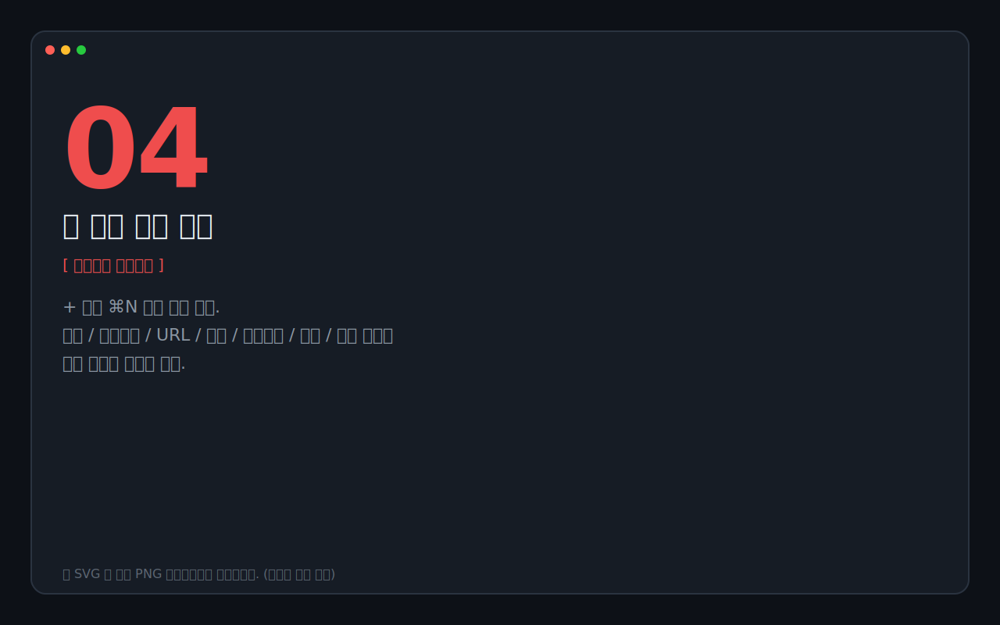

필드
- **제목** (필수) — 사이트 / 서비스 이름
- **사용자명** — 로그인 ID 또는 이메일
- **URL** — 사이트 주소
- **그룹** — 미리 만들어둔 분류 (없어도 OK)
- **변경 주기** — 90일 / 180일 등 권장 변경 간격
- **패스워드** (필수) — 직접 타이핑하거나 아래 🎲 생성기 사용
- **메모** — 자유 텍스트, 봉인 저장

"저장" 클릭하면 즉시 리스트에 등장하고 자동으로 선택됩니다.

---

## 5. 패스워드 생성기 사용하기

새 항목 모달 안의 **🎲 패스워드 생성기** 토글을 펼치면 됩니다.

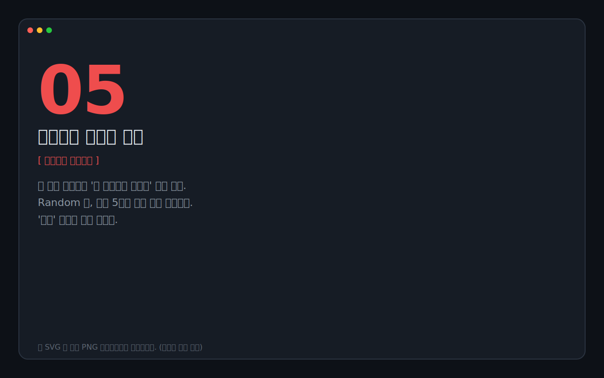

**Random 탭**
- 길이 슬라이더 (8~64)
- 문자 클래스 체크 (소문자 / 대문자 / 숫자 / 기호)
- 가독성 ON (0/O, l/1 등 시각적 혼동 문자 제외)
- 연속 제한 (같은 문자 연속 N+1회 방지)
- 각 클래스 최소 1자 ON

**Passphrase 탭** (Diceware 스타일)
- 단어 수 (2~12), 구분자, 첫 글자 대문자
- 외우기 쉬운 비밀번호: `Brave-Lemon-Cabin-Pixel-92` 같은 형태

**"5개 후보 생성"** 클릭 → 각각 강도 바와 함께 표시 → **"사용"** 으로 비밀번호 칸에 채움.

---

## 6. 항목 사용하기 — 복사 · 보기 · TOTP

상세 패널에서 각 필드를 활용합니다.


**패스워드 행**
- **값 영역 클릭** 또는 **📋 복사 아이콘** → 클립보드 (기본 30초 후 자동 클리어)
- **👁 보기** → 마스킹 토글 (잠깐 눈으로 확인용)

> ⚠️ 자동 입력(키스트로크) 기능은 v0.1 에서 제공하지 않습니다. 모든 전달은 클립보드 경유.

**TOTP 카드 (2단계 인증)**
- 처음엔 "TOTP 추가" 버튼만 보임 → 클릭 → 사이트가 준 `otpauth://...` URL 또는 base32 시크릿 붙여넣기
- 설정 후엔 황금색 6자리 코드 + 30초 도넛이 1초마다 갱신
- 코드 클릭 → 클립보드 복사
- 지원: SHA-1 / SHA-256 / SHA-512, 주기 1-3600초, 자릿수 6-10

**URL 행**
- 값 클릭 → 새 창으로 열기 (URL 있을 때)
- 복사 아이콘 → 클립보드

**상단 액션 (헤더 우측)**
- ★ 즐겨찾기 토글 — 사이드바 즐겨찾기 필터에 노출
- ✏ 변경 — 새 비번 + 변경 사유 입력 (자세히는 다음 절)
- 🗑 삭제 — 영구 삭제 (백업 있으면 복원 가능)

---

## 7. 비밀번호 변경 + 변경 이력

상세 헤더의 **"변경"** 버튼으로 새 비번 모달을 엽니다. 빠른 생성기까지 포함되어 있어요.

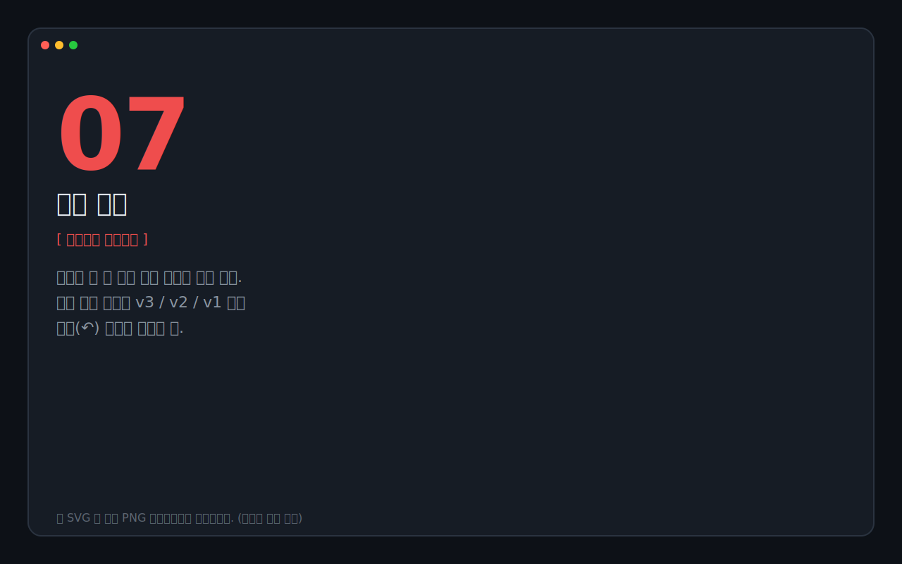

저장하면 상세 하단 **"버전 이력"** 카드에 새 버전이 쌓입니다. 각 버전마다:
- **v#** + "현재" 배지
- 변경된 시각 + 사유 메모
- **👁 보기** / **📋 복사** / **↶ 복원** 액션

옛 버전으로 되돌리고 싶으면 그 행의 **↶ 복원** → 확인 → 새 버전으로 기록됩니다 (옛 버전들도 그대로 보존).

상세 sub-title 옆의 ⏰/⚠/🗓 pill 은 **변경 주기 도래 여부**:
- 🗓 **다음 변경까지 N일**
- ⏰ **N일 후 변경 권장** (14일 이내)
- ⚠ **N일 지남 — 변경 필요** (이미 만료)

pill 클릭하면 변경 주기 자체를 수정할 수도 있어요.

---

## 8. 그룹으로 정리하기

사이드바의 **그룹 → "관리"** 버튼으로 모달을 엽니다.


- **새 그룹 추가**: 이름 입력 + 8색 팔레트에서 색 선택 → 추가
- **이름 변경**: 행의 ✏ 클릭 → 인라인 편집 → Enter 저장 / Esc 취소
- **색상 변경**: 🎨 클릭 시 8색 중 다음 색으로 순환
- **삭제**: 🗑 클릭 → 확인 → 그룹만 삭제되고 안에 있던 항목은 미분류로 이동

새 항목 추가 시 모달의 "그룹" 드롭다운에서 분류 가능. 상세 sub-title 의 그룹 pill 을 클릭하면 즉시 변경.

사이드바에서 그룹 이름 클릭 → 그 그룹 항목만 필터링.

---

## 9. 건강 검진으로 약점 찾기

사이드바의 **"건강 검진"** 항목 클릭.

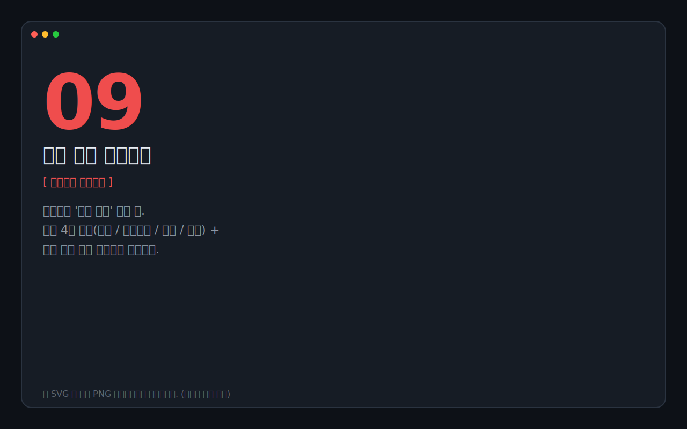

상단 카드 4개:
1. **전체 항목** — 관리 중인 항목 수
2. **평균 강도** — zxcvbn 0~4 점 평균. 색상은 평균 점수에 따라(빨강/노랑/초록).
3. **약한 비밀번호** — 점수 1 이하 항목 개수
4. **중복 사용** — 같은 비번을 쓰는 항목들 (SHA-256 해시로 그룹핑, 평문은 노출 X)

하단 섹션:
- **약한 비밀번호** 리스트 → 클릭하면 해당 항목으로 점프 → 변경 가능
- **중복 사용된 비밀번호** 그룹 → 그룹별로 어떤 항목들이 같은 비번 쓰는지
- **오래된 비밀번호 (1년+)** — `updated_at` 기준 1년 이상 안 바뀐 항목

각 항목을 클릭하면 일반 상세 화면으로 이동해 바로 "변경" 흐름으로 연결됩니다.

---

## 10. 백업과 복구

### 백업 내보내기

사이드바 → **"백업 내보내기"** → 마스터 비밀번호 재확인.

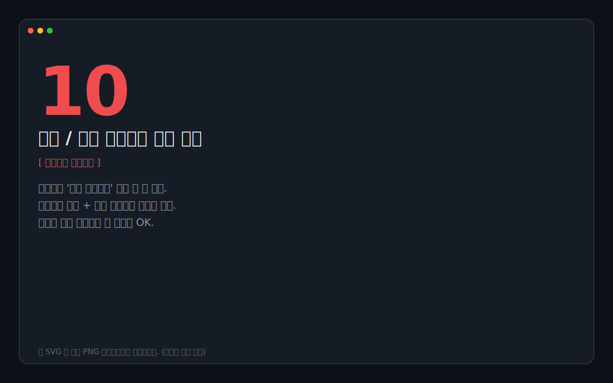

저장 다이얼로그에서 위치 선택 → `BoxPassword_backup_YYYY-MM-DD.bpvault` 같은 단일 파일 생성. 이 파일은 마스터 비밀번호 없이는 열 수 없습니다.

> 💡 **권장 보관 위치**: iCloud Drive 또는 Dropbox 폴더에 두면 자연스러운 동기화 효과. 단, 동시 편집 충돌은 해결 못 함.

### 복구

사이드바 → **"백업 복구"** → 마스터 비밀번호 → 파일 선택 다이얼로그에서 `.bpvault` 선택.

- 현재 vault 파일은 자동으로 `vault.db.bak` 으로 보존됨 (실수 방지)
- 복구 후 잠금 화면으로 자동 전환 → 마스터 비번으로 해제하면 백업 시점의 상태로 복원됨

---

## 11. 다른 매니저에서 CSV 가져오기

1Password / Bitwarden / Chrome 등 거의 모든 매니저가 CSV export 를 지원합니다. 그 파일을 그대로 붙여 넣으면 됩니다.

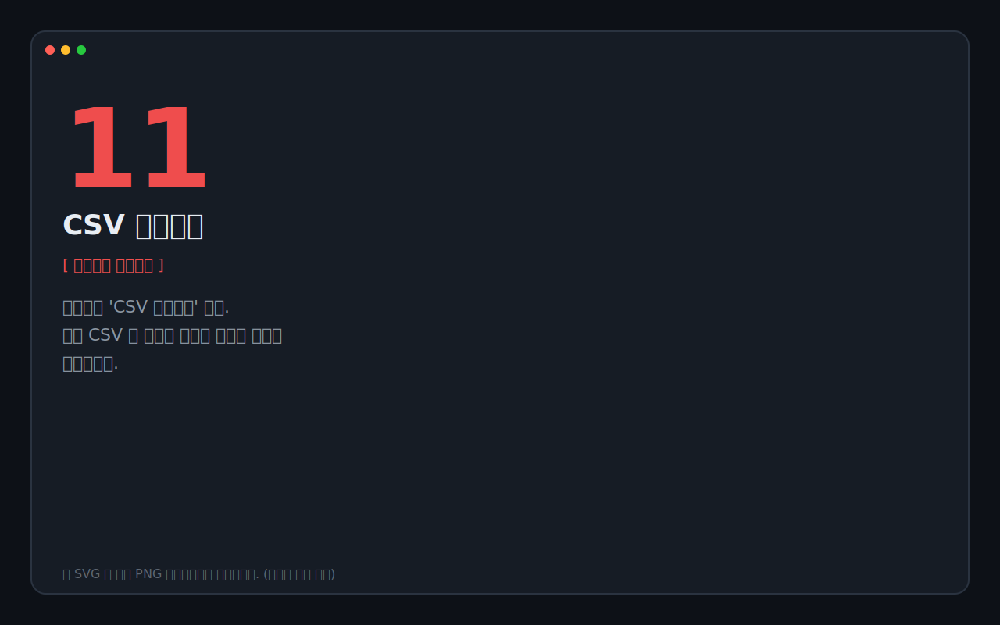

사이드바 → **"CSV 가져오기"** → 텍스트 영역에 CSV 전체 붙여넣기 → "가져오기".

자동 인식 컬럼 (헤더 대소문자 무시):
- 제목: `name`, `title`, `item name`
- 사용자명: `username`, `user`, `login_username`, `email`
- 패스워드: `password`, `login_password`
- URL: `url`, `website`, `login_uri`
- 메모: `notes`, `note`
- 그룹: `folder`, `group`, `category` → 자동으로 그룹 생성
- TOTP: `totp`, `login_totp`

토스트에 추가/건너뜀/새 그룹 카운트가 표시되고, 시스템 알림도 보냅니다.

### 매니저별 export 위치

| 매니저 | 경로 |
|---|---|
| **1Password** | 1Password 8 → File → Export → CSV |
| **Bitwarden** | 웹 vault → Tools → Export Vault → CSV |
| **Chrome** | `chrome://settings/passwords` → ⋮ → Export passwords |
| **Safari** | 환경설정 → 비밀번호 → ... → Export Passwords... |

---

## 12. 메뉴바 트레이로 빠르게 쓰기

macOS 메뉴바 우상단의 작은 빨간 vault 아이콘 (잠금 시 빨강 자물쇠 / 해제 시 초록 ✓).


좌클릭 또는 우클릭 → 메뉴:
- **🔍 빠른 검색…** (⌘⇧K) — 다음 절 참고
- **BoxPassword 창 열기** — 메인 윈도우 호출
- **★ 즐겨찾기** ▶ → 항목 클릭 즉시 클립보드 복사 (마스터 비번 없이도 OK, 단 OS Keychain 자동 해제 켜둔 경우)
- **🕒 최근** ▶ → 동일
- **🎲 비밀번호 즉시 생성** ▶ → 4가지 프리셋 (랜덤 20/32자, 패스프레이즈 5/7단어) 클릭 즉시 클립보드
- **Vault 잠그기** — ⌘L 단축키와 동일
- **클립보드 비우기** — 즉시 클리어
- **BoxPassword 종료** — 앱 완전 종료 (창 X 버튼은 단순 숨김)

> Windows 에서도 동일한 메뉴가 시스템 트레이 영역에 등장합니다.

---

## 13. Quick Search 글로벌 단축키 (⌘⇧K)

어떤 앱에 있든 **⌘⇧K** (Windows 는 Ctrl+Shift+K) 로 화면 중앙에 검색 팝오버를 띄울 수 있습니다.

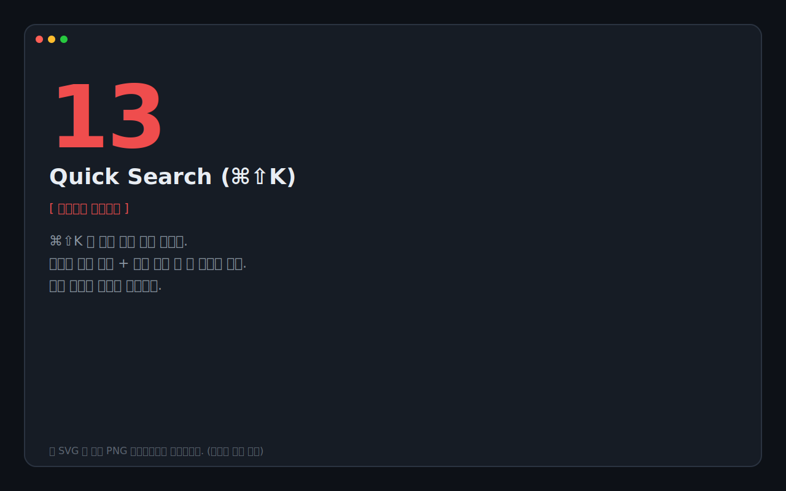

- 타이핑 → 매칭 항목 즉시 필터링 (제목 / 사용자명 / URL)
- **↑↓** 로 이동
- **Enter** → 클립보드 복사 → 팝오버 자동 닫힘
- **Esc** → 그냥 닫기

OS Keychain 자동 해제가 켜져 있으면 Vault 가 잠겨 있어도 silently 자동 해제 후 검색이 진행됩니다.

---

## 14. 설정 옵션 정리

사이드바 → **"설정"** 으로 모달을 엽니다.

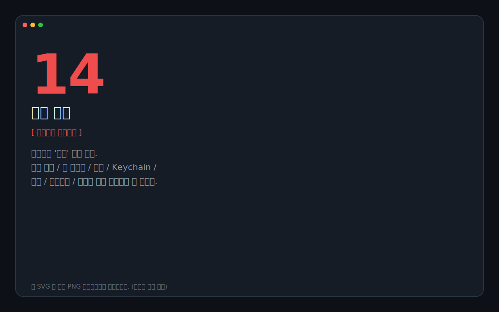

| 설정 | 의미 | 기본값 |
|---|---|---|
| **자동 잠금 시간** | 마우스/키보드 비활동 후 자동 잠금까지 | 5분 |
| **OS 자격 증명 저장소 자동 잠금 해제** | macOS Keychain / Windows Credential Manager 에 vault key 보관 → 다음 실행부터 자동 해제. 매번 마스터 비번 입력 없이 트레이/Quick Search 즉시 사용 | 끔 |
| **창 포커스 잃을 때 잠금** | 다른 앱으로 ⌘Tab 시 즉시 잠금 | 끔 |
| **시스템 슬립 시 잠금** | 노트북 닫았다 열면 자동 잠금 | 켬 |
| **알림** | 자동 잠금 / 클립보드 클리어 / 변경 주기 도래 시 macOS/Windows 시스템 알림 | 켬 |
| **클립보드 자동 비우기** | 패스워드 복사 후 자동 클리어까지 | 30초 |

하단의 **"마스터 비밀번호 변경…"** 으로 다음 절의 흐름으로 이동.

### Keychain / Credential Manager 보안 모델

자동 잠금 해제를 켜면 vault key 자체는 OS 보안 저장소(macOS Keychain 또는 Windows Credential Manager) 에 들어갑니다.

- **macOS**: 로그인 패스워드 / Touch ID 로 보호. 첫 저장 시 권한 다이얼로그 1회 → "Always Allow" 권장.
- **Windows**: 현재 사용자 프로필에 종속. 자격 증명 관리자 → Windows 자격 증명 → `com.boxpassword.app/vault-key` 항목에서 직접 확인/삭제 가능.

설정에서 토글 OFF 하면 항목이 즉시 삭제되고 다시 마스터 비번 모드로 복귀합니다.

---

## 15. 마스터 비밀번호 변경하기

설정 모달 하단의 **"마스터 비밀번호 변경…"** 버튼.

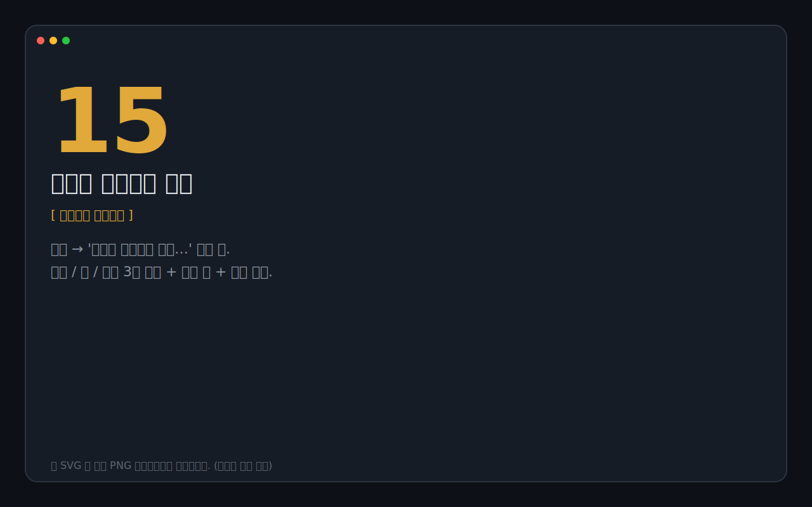

- 현재 비밀번호 1번 / 새 비밀번호 2번 입력
- 새 비밀번호에는 실시간 강도 바 표시
- 변경 즉시 옛 비번은 무효화. 항목 데이터는 **그대로 유지** (vault key 만 재봉인).
- OS Keychain 자동 해제를 켜둔 경우엔 거기 있는 항목도 자동으로 새 키로 갱신됩니다.

> 💡 **변경 후 백업 권장**: 마스터 비번 바뀐 직후엔 `.bpvault` 백업을 한 번 새로 떠두세요. 옛 백업은 옛 마스터 비번으로 열어야 한다는 점 주의.

---

## 자주 묻는 질문 (FAQ)

**Q1. 마스터 비밀번호를 잊어버렸어요.**
복구 경로가 없습니다. `.bpvault` 백업이 있고 그때의 비밀번호를 안다면 복구 가능. 둘 다 없으면 vault 를 새로 만드는 수밖에 없습니다.

**Q2. 다른 컴퓨터에서도 같이 쓰고 싶어요.**
v0.1 은 동기화를 지원하지 않습니다. 우회: vault 파일(`~/Library/Application Support/BoxPassword/vault.db` on macOS, `%APPDATA%\BoxPassword\vault.db` on Windows)을 iCloud Drive / Dropbox 같은 동기화 폴더에 두고 `BOX_PASSWORD_VAULT_PATH` 환경변수로 가리키게 하면 됩니다. 동시 편집 충돌은 직접 해결해야 함.

**Q3. 자동 잠금 해제 기능이 보안상 괜찮은가요?**
vault key 가 평문으로 디스크에 떠 있는 건 아닙니다. OS Keychain / Credential Manager 는 로그인 패스워드와 Touch ID/Windows Hello 로 보호된 별도 영역이에요. 다른 앱이 멋대로 접근할 수 없도록 OS 가 ACL 을 강제합니다. 단점: 누가 본인 OS 계정에 이미 로그인한 상태로 컴퓨터를 만진다면 트레이를 통해 비번을 꺼낼 수 있음. 그게 우려되면 토글을 끄세요.

**Q4. 클립보드 자동 비우기가 안 되는 것 같아요.**
다른 앱이 그 사이 다른 것을 클립보드에 넣었다면 BoxPassword 는 건드리지 않습니다 (SHA-256 해시로 일치 확인). 30초 후에도 패스워드가 그대로 클립보드에 있다면 자동으로 빈 문자열로 교체됩니다.

**Q5. TOTP 코드가 사이트 코드랑 안 맞아요.**
시스템 시간이 잘못된 경우가 90%. macOS: 시스템 설정 → 일반 → 날짜 및 시간 → "자동으로 설정" 켜기. 그래도 안 맞으면 시드 입력값 (otpauth URL 의 secret 파라미터) 을 다시 확인해 보세요.

**Q6. 백업 파일을 분실해도 데이터가 살아 있나요?**
`vault.db` 파일이 본체이고 `.bpvault` 는 외부에 두는 봉인 사본일 뿐입니다. vault 파일이 있으면 백업 없이도 정상 사용 가능. 두 파일 모두 잃어버리면 복구 불가.

**Q7. macOS 에서 "확인되지 않은 개발자" 경고가 나옵니다.**
정식 코드사인을 안 받은 빌드라 그렇습니다. 첫 실행 시 `.app` 우클릭 → "열기" → "열기" (한 번만) 또는 터미널에서:
```
xattr -dr com.apple.quarantine /Applications/BoxPassword.app
```

**Q8. Windows 에서 SmartScreen 경고가 나옵니다.**
"추가 정보" → "실행" 으로 우회. EV 코드사인 인증서를 발급받아 빌드하면 경고가 사라지지만 v0.1 범위 밖입니다.

---

문제 신고나 기능 제안은 GitHub Issues 에 부탁드립니다.
